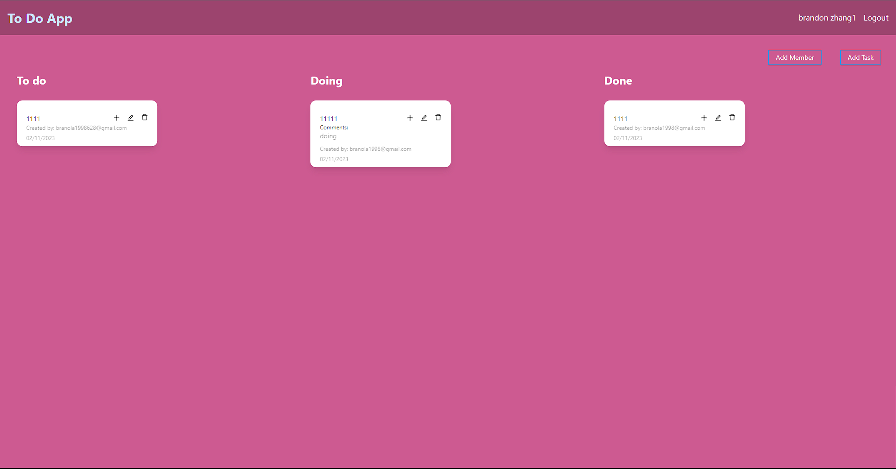

# Todo Mate

[](https://opensource.org/licenses/MIT)
[](https://www.npmjs.com/package/concurrently)
[](https://www.npmjs.com/package/bcrypt)
[](https://www.npmjs.com/package/apollo-server)
[](https://www.npmjs.com/package/express)
[](https://www.npmjs.com/package/mongoose)
[](https://www.npmjs.com/package/graphql)
[](https://www.npmjs.com/package/jsonwebtoken)

## Description

Todo Mate is a MERN stack application designed to provide a robust and interactive project management tool. It replicates the core functionalities of Trello, allowing users to create boards, manage tasks, and collaborate in real-time. The application leverages JWT for secure authentication, Apollo Server for GraphQL API management, and Mongoose for smooth data handling with MongoDB. The interface is intuitive, making it easy for users to drag and drop tasks, organize projects, and track progress effectively.

## Table of Contents

- [Demo](#demo)
- [Installation](#installation)
- [Usage](#usage)
- [Features](#features)
- [Contributing](#contributing)
- [License](#license)
- [Credits](#credits)
- [Acknowledgements](#acknowledgements)
- [Questions](#questions)

## Demo

Visit the deployed site for a demo!
https://tasks-management-dragndrop-5ac20ab695af.herokuapp.com/login



## Installation

To install the application, follow these steps:

```
git clone https://github.com/yourusername/todo-mate.git
cd todo-mate
npm install
```

## Usage

**Running the Application:**

1. Set up your MongoDB database and ensure it's running.
2. Create a `.env` file in the root directory and add your JWT secret and database URI.
3. Use `npm start` to run the server and client concurrently.

**Navigating the Application:**

1. Register for an account or log in if you already have one.
2. Create a new board and add lists to organize tasks.
3. Add cards to the lists to track individual tasks.
4. Drag and drop cards between lists as tasks progress.

**Utilizing Features:**

- Manage user profiles with secure authentication using JWT.
- Real-time collaboration on boards and tasks.
- Use Apollo Server to interact with GraphQL for dynamic data updates.

## Features

- JWT Authentication for secure access.
- Real-time updates with Apollo Server and GraphQL subscriptions.
- Intuitive drag-and-drop interface for task management.
- MERN stack for a full JavaScript development experience.

## Contributing

Contributions are welcome! For major changes, please open an issue first to discuss what you would like to change.

## License

This project is licensed under the MIT license.

```
Copyright <2023> <Brandon Zhang>

Permission is hereby granted, free of charge, to any person obtaining a copy of this software and associated documentation files (the “Software”), to deal in the Software without restriction, including without limitation the rights to use, copy, modify, merge, publish, distribute, sublicense, and/or sell copies of the Software, and to permit persons to whom the Software is furnished to do so, subject to the following conditions:

The above copyright notice and this permission notice shall be included in all copies or substantial portions of the Software.

THE SOFTWARE IS PROVIDED “AS IS”, WITHOUT WARRANTY OF ANY KIND, EXPRESS OR IMPLIED, INCLUDING BUT NOT LIMITED TO THE WARRANTIES OF MERCHANTABILITY, FITNESS FOR A PARTICULAR PURPOSE AND NONINFRINGEMENT. IN NO EVENT SHALL THE AUTHORS OR COPYRIGHT HOLDERS BE LIABLE FOR ANY CLAIM, DAMAGES OR OTHER LIABILITY, WHETHER IN AN ACTION OF CONTRACT, TORT OR OTHERWISE, ARISING FROM, OUT OF OR IN CONNECTION WITH THE SOFTWARE OR THE USE OR OTHER DEALINGS IN THE SOFTWARE.
```

## Credits

Project is developed and maintained by Brandon Zhang.

## Acknowledgements

Special thanks to the developers and contributors of the following tools and libraries:

- **Concurrently**: For running multiple commands concurrently during development.
- **Apollo Server**: For simplifying the GraphQL server setup.
- **Mongoose**: For object data modeling and seamless interaction with MongoDB.
- **GraphQL**: For enabling a powerful query language for our API.

The open-source community is integral to the success of projects like this, providing invaluable resources that enable developers to create powerful, efficient, and collaborative applications.

## Questions

For any questions, please contact me via email or GitHub.

Email: branola1998628@gmail.com

GitHub: [verouge](https://github.com/verouge)
